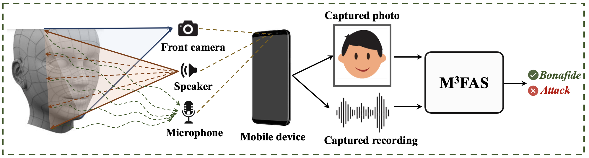

# Introduction
**Pytorch implementation of "M<sup>3</sup>FAS: An Accurate and Robust MultiModal Mobile Face Anti-Spoofing System", IEEE TDSC 2024.**
<p align="center">
 
</p>
Illustration of M3FAS system. The mobile device employs the front camera to capture the input RGB face photo. Meanwhile, the top speaker emits a customized acoustic signal, and the microphone collects the reflected signal modulated by the live/spoof face. The captured face picture and acoustic recording are sequentially fed forward to M3FAS for final decision-making.

# Dataset
https://portland-my.sharepoint.com/:f:/g/personal/cqkong2-c_my_cityu_edu_hk/ElqjO09_fUtOgyg_5u4s7-4BZTKK7GPhpn9xj_JDtn6vKg?e=B3h4gq

# Pretrained models
https://drive.google.com/drive/folders/147zfFSMcHz6NWeWx-ZanF3ogIm7ClTrT?usp=sharing

# Usage
1. Download Echoface-Spoof database.  
2. Implement "python train_cross_device.py", "python train_cross_env.py", or "python train_cross_id.py" for reproducing the results. (change the training, validation, and test csv paths for different settings.)
3. Download pretrained models for inference.

# Prerequisites:
See environment.txt

# Citation
```
@article{kong2024m,
  title={M $\^{}$\{$3$\}$ $ FAS: An Accurate and Robust MultiModal Mobile Face Anti-Spoofing System},
  author={Kong, Chenqi and Zheng, Kexin and Liu, Yibing and Wang, Shiqi and Rocha, Anderson and Li, Haoliang},
  journal={IEEE Transactions on Dependable and Secure Computing},
  year={2024},
  publisher={IEEE}
}
 ```
